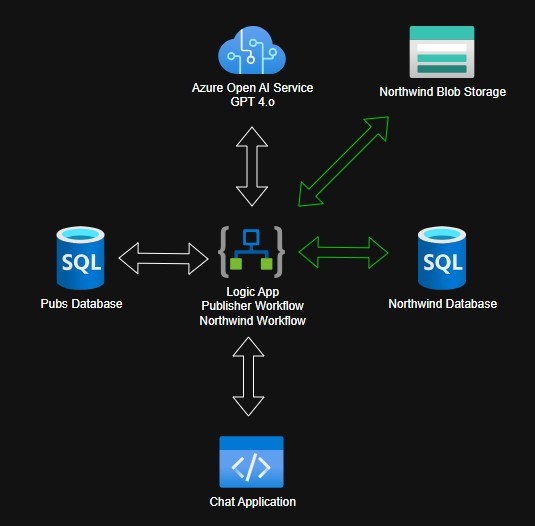
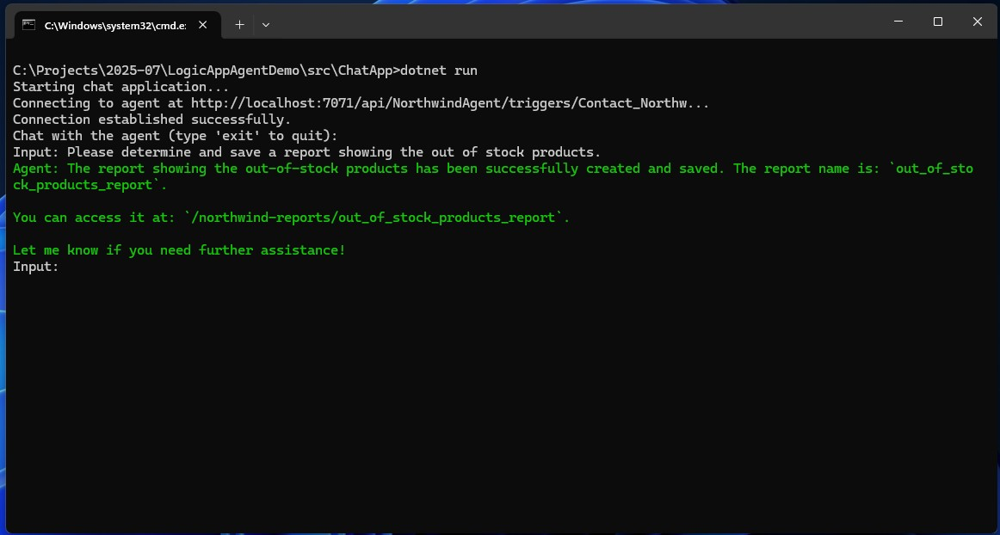
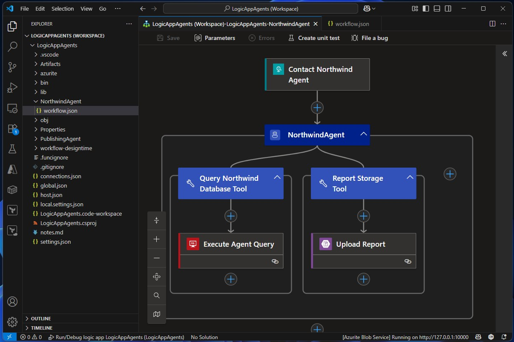
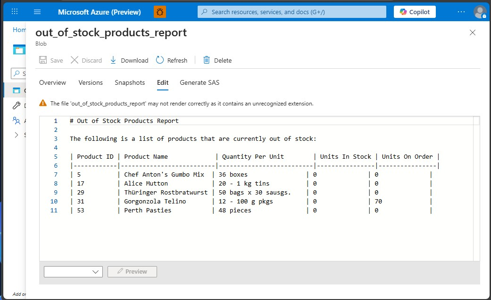
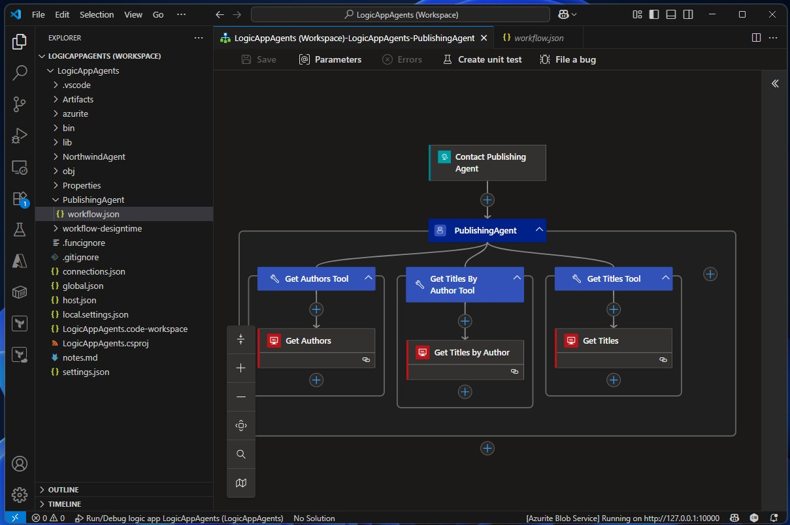

# LogicAppAgentDemo
This repo demonstrates a chat application interacting with an AI agent implemented using Azure Logic Apps.

# Overview
Here, you'll find a simple, console-based chat application that was built to interact with Azure Logic Apps Agent Loop.  This console app may be connected to the included Logic App project and configured to speak with one of two agents: Publishing, or Northwind.  When connected, the user may ask the agents questions about its connected data repositories.

The Publishing Agent is connected to a SQL Database that was built using the classic, Microsoft Pubs sample.  The Northwind Agent is connected to a separate SQL Database that was built using the classic, Microsoft Northwind sample.  The Northwind Agent also has the ability to write reports to a connected Azure Blob Storage Account.

# Architecture
The demo was built with Azure Logic Apps Agent Loop at the center.  The Agent Loop uses Azure OpenAI and the GPT 4.o model as the artificial intelligence driving both conversation and actions.

# Sample Flow
Here, you can see the chat application was used to ask the Northwind Agent a question:

The replies shown in the previous image were generated by the Northwind Workflow.  It looks like this:

The Northwind Agent generated and wrote this report in response to the user's question:

Additionally, the Logic App also has a simpler Publisher Agent available:

